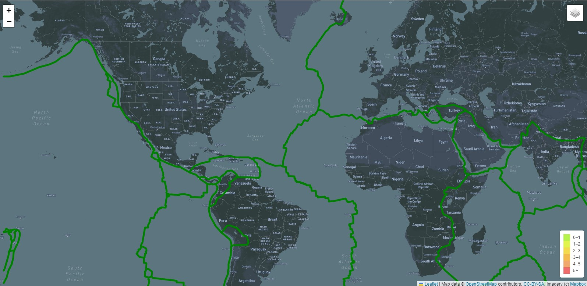

# Mapping Earthquakes using JavaScript, D3, Leaflet, Mapbox, HTML & CSS.

We will be working with the Distater Reporting Network, a nonprofit company that provides data driven
story telling on disasters around the world. 
We will build insightful data visualizations with interactive features on earthquakes from around the world. 
The data to be used will be a GeoJSON file from the US Geological Surver website, we will retrieve the data
using JavaScript, d3, leaflet, and plot the information on a Mapbox map through an API request. 
The magnitude and location of earthquake will be shown in a popup marker, the diameter of the marker should
reflect the magnitude of the earthquake in their size and color.

## Overview

The data that will be displayed is:
* Earthquakes: All Earthquake data from the past 7 days
* Tectonic plates: The location of the tectonic plates
* Major earthquakes: Earthquakes above 4.5 from the past 7 days

The purpose of the project was to add three different base layers and three overlayers using Leaflet. 
The base layers styles were imported from the Mapbox API. These layers will change the map visually and the overlayers will display different information and could be shown or hidden at the same time. 
A control layer was implemented in order to add them to the map object and to interact with them. 
D3 was used to import the json file from the US GS website, different functions were created to give style to the circlemarkers,such as color, size, and diamater. 
Finally an HTML and CSS files were created to give format and display the maps correctly.

## Results

* The index.html file displays the map correctly, showing all earthquakes, the tectonic plates and the earthquakes greater than 4.5 .

* Three different styles of maps and information layers were added for user's preference.

* A color scale is displayed to shown the intensity of the earthquake.

